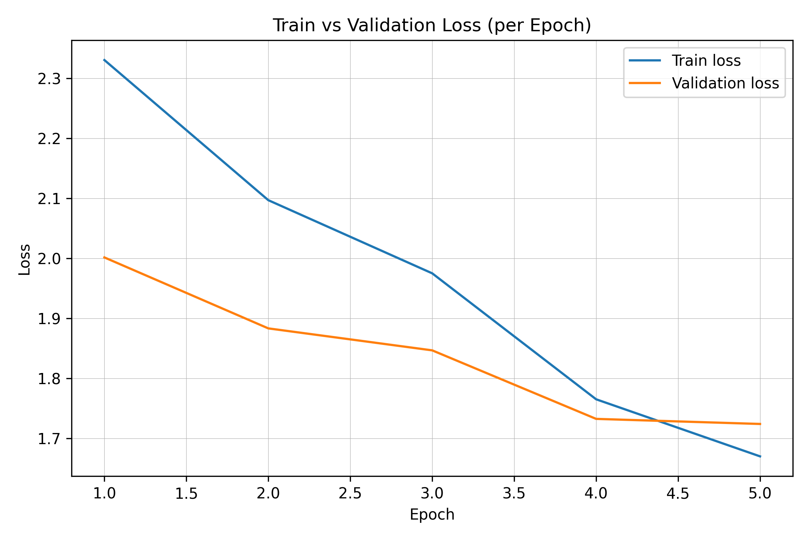

# 🖼️ Multimodal Image Captioning with BLIP (Flickr8k)

## 📌 Overview
This project fine-tunes [BLIP (Bootstrapping Language-Image Pretraining)](https://huggingface.co/Salesforce/blip-image-captioning-base)  
on the **Flickr8k dataset** to generate natural image captions.  

The pipeline includes:
- Data preprocessing & splitting
- Training with LoRA (parameter-efficient fine-tuning)
- Loss tracking (train vs validation)
- Single- and multi-reference evaluation
- Inference demo (Gradio / Hugging Face Spaces)

---

## 🎯 Features
- ✅ Fine-tuned BLIP for image captioning  
- ✅ **Single- and Multi-reference evaluation** (BLEU, ROUGE-L, METEOR)  
- ✅ Training pipeline notebook (Kaggle)  
- ✅ Final demo for caption generation  
- ✅ Ready to extend with Hugging Face Spaces  

---

## 📊 Results

### 🔹 Metrics (Test Set)
| Metric    | Single-ref | Multi-ref |
|-----------|------------|-----------|
| **Loss**  | 1.745      | -         |
| **BLEU-1**| 0.283      | 0.568     |
| **BLEU-2**| 0.171      | 0.411     |
| **BLEU-3**| 0.108      | 0.291     |
| **BLEU-4**| 0.069      | 0.204     |
| **ROUGE-L** | 0.327    | 0.455     |
| **METEOR**  | 0.339    | 0.512     |

---

### 🔹 Training Progress  
<p align="center">
  
</p>

---

### 🔹 Sample Predictions
<p align="center">
  
</p>

---

## 🚀 How to Run

### 1️⃣ Clone & Install
```bash
git clone https://github.com/<your-username>/multimodal-image-captioning.git
cd multimodal-image-captioning
pip install -r requirements.txt
```

### 2️⃣ Training & Evaluation (Kaggle Notebook)
Full pipeline is available in:
```
notebooks/kaggle_pipeline.ipynb
```

### 3️⃣ Inference
Use the provided demo (Gradio or Spaces) or load the trained model:

```python
from transformers import BlipProcessor, BlipForConditionalGeneration, AutoTokenizer
from PIL import Image
import torch

# Load model
model = BlipForConditionalGeneration.from_pretrained("./blip_caption_model/final").eval()
processor = BlipProcessor.from_pretrained("Salesforce/blip-image-captioning-base")
tokenizer = AutoTokenizer.from_pretrained("./blip_caption_model/final")

# Inference
img = Image.open("example.jpg").convert("RGB")
inputs = processor(images=img, return_tensors="pt")
out = model.generate(**inputs)
print(tokenizer.decode(out[0], skip_special_tokens=True))
```

---

## 🌐 Demo
- 🔗 [Hugging Face Spaces Demo](https://huggingface.co/spaces/<your-space>) *(optional)*  
- Or run locally with Gradio (`app.py`).

---

## 📂 Repository Structure
```
├── notebooks/
│   └── kaggle_pipeline.ipynb       # Full training & evaluation
│
├── results/
│   ├── train_vs_val_loss.png       # Training vs Validation Loss
│   └── samples/                    # Sample captioned images
│       ├── photo1_captioned.jpg
│       ├── photo2_captioned.jpg
│       └── gallery.jpg
│
├── requirements.txt                # Dependencies
├── README.md                       # This file
```

---

## 📜 License
MIT License. Free to use with attribution.  

---

## ✨ Acknowledgements
- [BLIP model (Salesforce)](https://huggingface.co/Salesforce/blip-image-captioning-base)  
- [Flickr8k Dataset](https://www.kaggle.com/datasets/adityajn105/flickr8k)  
- Kaggle for training environment  
